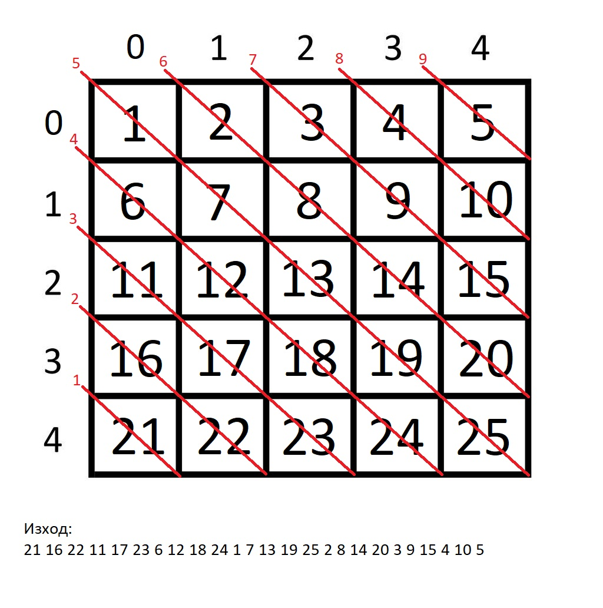
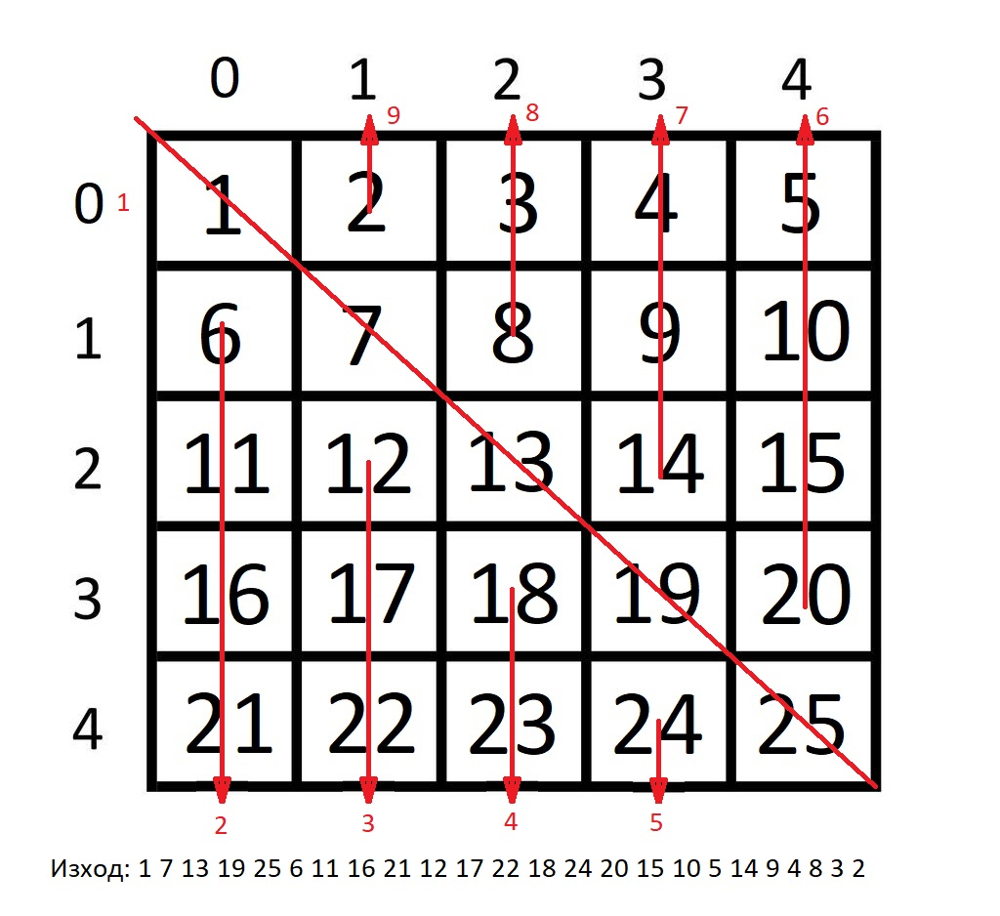
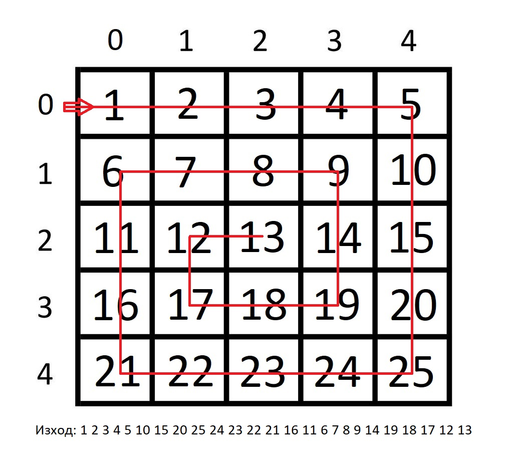

# Week 7

*В следващите задачи матриците са квадратни (n x n, където n се въвежда от клавиатурата). Елементите могат да се въвеждат от потребителя или да се генерират автоматично (по избор). За генериране на произволни числа вижте примера в следващия линк:*

http://www.cplusplus.com/reference/cstdlib/rand/

## Задача 1
Да се обходи диагонално двумереният масив и да се изпишат на екрана елементите на му  както е показано в примера:

## Задача 2
Да се обходи двумерния масив и да се изпишат елементите му в следната последоватеност:
* Първо главният диагонал (отляво надясно)
* След това колоните под главния диагонал (отляво надясно). Елементите от всяка колона отдолу на горе.
* Накрая колоните над главния диагонал (отдясно на наляво). Елементите в колоните да се обходят отдолу нагоре.

## Задача 3
Да се обходи двумерния масив спираловидно и  да се принтират на екрана елементите му както е описано на изображението:

